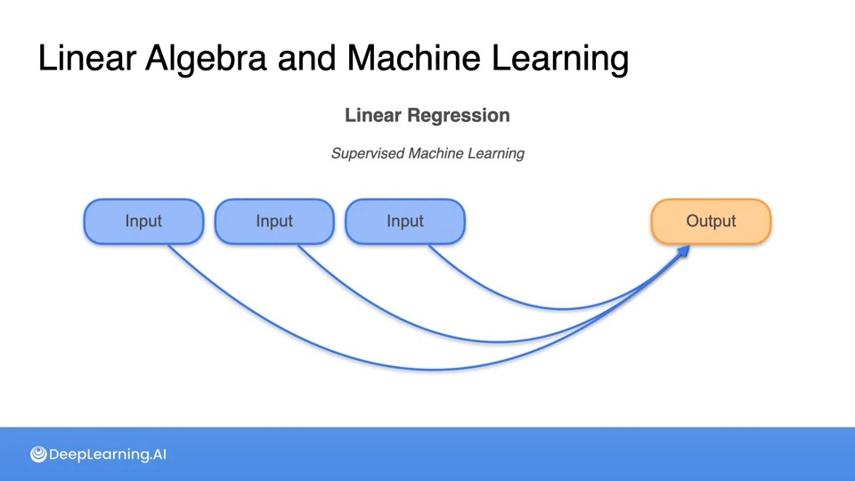

# Linear Algebra

# Systems of Equations

## Linear Algebra and Machine Learning

- A common machine learning approach to modeling systems is called Linear Regression

- You can make accurate predictions of the output under the assumption that this is a linear relationship

- You’d find the values of the weight and bias terms that solve all these equations at the same time, From this common machine learning model appears a fundamental  concept of linear algebra called a **system of linear equations**.

- Linear Algebra is all about manipulating vectors and matrices to do powerful calculations, This math is the backbone of many machine learning models.

## System of Sentences

- The way sentences combined to give you information is similar to the way equations combined to give you information.

- When a system is complete is called a **non-singular system**, A **non-singular system** is a system that carries as many pieces of information as sentences, It’s the most informative the system can be.
- A **singular system** is less informative than a non-singular one.

## System of Equations

- Just like with **systems** of **sentences**, **systems** of **linear equations** can also be **singular** or **non-singular** based on how much information they carry.

## System of Equations as lines and planes

- Linear equations can easily be visualized as lines in the coordinate plane and systems of linear equations can be represented as arrangements of lines in the plane. This way, you can visualize their solutions and their singularity, or non singularity in a much clearer way.

- The notion of **slope** and **y-intercept** in a line, The **slope** of a line is a measure of its steepness. Mathematically, slope is calculated as "rise over run”,
- For the line on the **left** is $-1$ as for every unit you move to the right, the line move one unit down.
- For the line on the **right**, the **slope** is $\frac{-1}{2}$  because for every unit you move to the right, line moves half a unit down.

- In the same way as a linear equation with two variables correspond to a line in the plane. A linear equation on three variables correspond to a plane in space.
- In the same way as we used to intersect lines to get points as the solutions to the systems equations, you can also intersect planes.

## A Geometric Notion of Singularity

- There is an even simpler way to visualize singularity and non-singularity. It involves slightly simplifying the system. Note that system 2 and 3, the singular ones, are very similar since both consists of parallel lines.
- We can contract system 2 and 3 into one bucket by looking at the constants of the systems of equations, These constants are the numbers in the equations that are not accompanying the variables A or B.

- If we turn all these constants for all these three systems into 0 and see what happens to the plots. The new systems always have the 0.00 as a solution, so they must pass by the origin.
- Notice that system 1 is still a pair of intersecting lines, so it still has a unique solution. So it's still complete and non-singular.
- System 2 is still a pair of identical lines, so it still has infinite solutions, so it's redundant and singular.
- System 3 went from a pair of non-intersecting parallel lines to a pair of identical lines. So now it has infinitely many solutions instead of none. It went from contradictory to redundant. However, it stayed singular as before.
- So in conclusion, the constants in the system don't matter when it comes to determine the system is singular or non-singular.
- You can now start considering systems of equations where the constants are always 0, These are much simpler.

## **Singular vs non-singular matrices**

- **Matrices** have lots of very important properties and they arise from many different places in math. In our case, They will arise from the **coefficients** in a system's of equations in a very natural way.
- **Matrices** like systems of linear equations can also be singular or non-singular.

## Linear Dependence and Independence

- A system of equation is singular if the second equation carries the same information as the first one. This is the concept of **linear dependence**.

## The Determinant

- There is a much faster way to tell if a matrix is singular or non-singular, It's called the **determinant** and it is a quick formula that returns a zero if the matrix is singular and a number different from zero if the matrix is non-singular.
- the **determinant** is zero if the matrix is **singular** and non-zero if it's **non-singular.**

- The determinant for three-by-three matrix is a bit more complicated than that for two-by-two matrix, but it is mostly the same.
- Here are the diagonals in 2 x 2 and 3 x 3 matrices:

- For the determinant, you're simply going to add the products of the elements in these diagonals and subtract the products of the elements in these diagonals that go the other way around.

# Solving Systems of Linear Equations: Elimination

## **Solving non-singular system of linear equations**

- we will learn a method that finds the solution to a system of linear equations and can tell you if the system is singular or non-singular.

## Solving singular system of linear equations****

## **Solving systems of equations with more variables**

## Matrix Row-Reduction

- **Matrix row reduction,** also called the **Gaussian elimination**, consists of applying the exact same manipulations except to the rows of a matrix. In order to turn that matrix into a much more simplified form, from which you can extract lots of useful information.
- From the original matrix, you can get the matrix in the intermediate system by applying some row manipulations. An important feature of this matrix is that it has 1s in the main diagonal and zeros underneath the diagonal and is called **Row Echelon Form.**
- Finally, some more manipulations will get you to the matrix with ones in the diagonal and zeroes everywhere else and is called Reduced **Row Echelon Form**

- A matrix in **row echelon form** looks like one of the following:
    - For 3 x 3 matrices:
        - On the main diagonal, we can have bunch of ones followed by perhaps a bunch of zeros.
        - On the main diagonal, we can have all ones.
        - On the main diagonal, we can also have all zeros.
        - Below the diagonal, everything is a zero.
        - To the right of the ones any number is allowed
        - Finally to the right of the zeros, everything must be zero.
    - For 2 x 2 matrices:
        - You can have two 1s in the diagonal
        - You can have one 1s in the diagonal.
        - you can have zero 1s in the diagonal.

## **Row operations that preserve singularity**

- The same manipulations that you use to solve systems of linear equations can be used in matrices. These are called **row operations** in a matrix
- A very important property that they have is that they preserve the **singularity** of a matrix. In other words, if you apply them to a **singular matrix**, you get a **singular matrix** and if you apply them to a **non-singular matrix**, you get a **non-singular matrix**.
- The Row Operations that preserve singularity:

# Solving System of Linear Equations: Row Echelon Form and Rank

## The Rank of a Matrix

- **Rank of a matrix**  measures how much information that matrix or its corresponding system linear equations is carrying.
- One great application of ranking machine learning is an **image compression**. The image below uses a lot of storage because every pixel intensity has to be stored as a number.
- We can store this image or perhaps a slightly blurrier version of it using significantly less space. By utilizing rank of a matrix.
- It turns out that pixelated images are matrices and the rank of matrix is related to the amount of space that is needed to store that corresponding image.
- There's a very powerful technique on **singular value decomposition(SVD)**, which can reduce the **rank of a matrix** while changing it as little as possible.
- Notice how the images of rank 15 and 50 are very similar to the original and we take a lot less space to store.

- The amount of information a system of sentences carries is defined as the rank of the system.

- Rank of the matrix is defined as the rank of the corresponding system of equations.

- There's a special relationship between the **rank of a matrix** and its **solution space**. The **solution space** for each matrix is the set of solutions to the system of equations when the **constants** are **zero**.

- For the first one the solutions are only a=0 and b=0. So that's a point and the dimensional solution space is 0 because the dimension of a point is 0.
- For the second one, the set of solutions was some line and a line has dimension 1. So the dimension of the solution space was 1.
- For the third one, well every a and b works here because any point a and b is a solution to that system. Therefore the solution space is a plane and it has dimension 2.
- **Rank of matrix** is equal to **number** of **rows** in the matrix minus the dimension of the **solution space**.

- A matrix is non-singular if only has full rank, namely if the rank is equal to the number of rows.

## The Rank of a Matrix in General

- This is how the Rank works for larger matrices.

## Row Echelon Form

- There is a simpler way to calculate the rank using **Row Echelon Form of a matrix.**
- We used the systems of equations to find **Row Echelon Form of a matrix**. We can use the row operations to calculate the **row echelon form.**

- The **rank of a matrix** is the number of **ones** in the diagonal of the **row echelon form**. Also a matrix is **NON-singular** if and only if the **row echelon form** has **only ones** and **no zeros.**

## **Row echelon form in general**

## Reduced Row Echelon Form

- The way to get from the **row echelon form** matrix to the **reduced row echelon form** is simply to use each 1s in the diagonal to disappear all the non-zero entries above.

## **The Gaussian Elimination Algorithm**

- It is just the **elimination** method you studied before but restructured to solve a system of equations and formalize so that it can be followed by hand or implemented in code.
- Recall that when you learn about the singularity of a matrix, you ignore the constant values on the right-hand side of your equations. You treated them as though they were just zero.
- To actually solve a **system of equations**, you will use them. To begin, make a matrix from the coefficient in your system of equations and add another column to the right side of your matrix, which holds the constant values. This is called the **augmented matrix**. The vertical line is used to separate the constants, so you remember they're not part of the variables.
- You can use the augmented matrix to solve your system of equations using the Elimination method.

- To complete the elimination method, you'll repeatedly find an element called a **pivot** on the diagonal of the matrix. To start, you'll select the top left cell as your **pivot**. Use row operations to set your **pivot** to **one**. Then use row operations to set all the values below your **pivot** to **zero**. After that repeat the process row by row using row operations to simplify the matrix down to the **reduced row-echelon form**.
- Whatever row operations you perform on the matrix will also be applied to the **column** of **constants** you included to form the **augmented matrix**. They'll eventually help us solve the system of equations

- here we reached the **Row Echelon Form,** The diagonal is all ones, and below the diagonal, there's only zeros.

- Then we will use the information in constant column to actually solve the **system of equations** through a process called **back substitution**.
- Here's how **back substitution** works, You will start from the bottom row and work your way to the top. You'll use the **pivot** from each row to cancel the values in the cells above it.

- Do that until you've got a matrix that has all ones in the diagonal and zeros on all other positions.
- Note that the square part of the **augmented matrix** has only 1s in the diagonal. Such a matrix is called the **identity matrix**. By simplifying the matrix to this form using **Gaussian elimination**, you have solved the original **system** of **equations**.

- Will Gaussian elimination work if the matrix is singular?
    - We know that if the matrix is singular, then in reduced **row-echelon form**, you'll have a row that is all zeros. Once you get here, the algorithm just stops.
    - The whole point of **Gaussian elimination** is to find solutions to a **system** of **equations**. If you find a row of zero, you know your matrix is singular and there is no solution.
    
    
    
    - You can still determine if your matrix is **contradictory** and has **no solutions** or if it has **infinitely** many **solutions**.
    - To do that, you just need to look at the **column** of **constants**. If the **constant** value in the **row** of **zero** is also **zero**, the row just says 0a+0b+0c = 0. No matter what values you choose for A, B, and C, the left side will always equal zero, and this equation will be true. The system has **infinitely many solutions.**
    
    
    
    - if  you get a matrix with the **constant value** in the **third** row changing to say four. Now the last row states that 0a+0b+0c = 4. No matter what values of A, B, and C you choose, the left side of the equation will equal zero, but the right side equals four. This means that the system h**as no possible solutions**.
    
    

## Gaussian Elimination Algorithm Wrap Up

Gaussian elimination offers a systematic approach to solving systems of linear equations by transforming an augmented matrix into row-echelon form, thereby enabling the determination of variables. The algorithm comprises several essential steps:

### Step 1: Augmented Matrix

Consider a system of linear equations:

$$
\begin{align*}
2x_1 + 3x_2 + 5x_3&= 12 \\
-3x_1 - 2x_2 + 4x_3 &= -2 \\
x_1 + x_2 - 2x_3  &= 8 \\
\end{align*}
$$

Create the augmented matrix ([A | B]), where (A) represents the coefficient matrix and (B) denotes the column vector of constants:

$$
A = \begin{bmatrix}
\phantom{-}2 & \phantom{-}3 & \phantom{-}5  \\
-3 & -2 & \phantom-4 \\
\phantom{-}1 & \phantom{-}1 & -2  \\
\end{bmatrix}
$$

$$
B = \begin{bmatrix}
\phantom-12 \\ -2 \\ \phantom-8 
\end{bmatrix}
$$

Thus, \([A | B]\) is represented as:

$$
\begin{bmatrix}
\phantom{-}2 & \phantom{-}3 & \phantom{-}5 & | & \phantom{-}12 \\
-3 & -2 & \phantom-4 & | & -2 \\
\phantom{-}1 & \phantom{-}1 & -2 & | & \phantom{-}8 \\
\end{bmatrix}
$$

### Step 2: Transform Matrix into Reduced Row Echelon Form
Initiate row operations to convert the augmented matrix into row-echelon form. The objective is to introduce zeros below the leading diagonal.

- **Row Switching:** Rearrange rows to position the leftmost non-zero entry at the top.
- **Row Scaling:** Multiply a row by a non-zero scalar.
- **Row Replacement:** Substitute a row with the sum of itself and a multiple of another row.

### Step 3: Solution Check

Examine for a row of zeros in the square matrix (excluding the augmented part).

Consider the following cases:

1. If no row comprises zeros, a **unique solution** exists.
2. If one row contains zeros with a non-zero augmented part, the system has **no solutions**.
3. If every row of zeros has a zero augmented part, the system boasts **infinitely many solutions**.

### Step 5: Back Substitution

After attaining the reduced row-echelon form, solve for variables starting from the last row and progressing upwards.

Remember, the aim is to simplify the system for easy determination of solutions!

import os

# Directory containing the files
directory = '/path/to/your/directory'

# temp

# Vector Algebra

## Vectors and their Properties

- we’ve learned matrices as a race of numbers. A vector is a simpler way of number that only has one column. It turns out that vectors can be seen as arrows in the plane or in a higher dimensional space.
- Two very important components of vectors are their magnitude, and their direction.
- The number of coordinates in the vector is the dimension of the space in which it lives.

- To find the magnitude or size of a vector, There’s two ways to calculate it using **L1 Norm or L2 Norm.**
- We are using absolute value because vector can be in any directions but distance can only be positive.

- By default, when you specify with norm to use, we are using the L2 norm. The reason is that it's a more natural one because precisely it is the length of the arrow.

- The direction of a vector can also be deduced from its coordinates.

## **Sum and difference of vectors**

## **Distance between vectors**

- The difference between two vectors is helpful to tell how far apart two vectors are from each other.

## **Multiplying a vector by a scalar**

## **The Dot Product**

- The **dot product** is a very nice and compact way to express systems of linear equations using matrices and vectors.

- The **L2 norm** is always the **square root** of the **dot product** between the vector and itself.

- A **Transpose** essentially transforms columns into rows, denoted by superscript $T$.

## Geometric Dot Product

- The angle between two vectors is very important. There are some nice relations between the angle and the **dot product**.
- A two vectors are orthogonal if and only if the **dot product** is zero.

- you can tell if the dot product between two vectors is positive, negative, or zero. The sign of the dot product of a vector corresponds to being on one side or the other one off that perpendicular vector.

## **Multiplying a matrix by a vector**

# Linear Transformations

## Matrices as Linear Transformations

- Another very powerful and very useful representation of matrix is called a **linear transformation**.
- **A linear transformation** is a way to send each point in the plane into another point in the plane in a very structured way.
- The square on the left is called a **basis**. And so is the parallelogram on their right.

- A very special property that **basis** have is that they cover the entire plane. Since this square actually tessellates the whole plane and the parallelogram tessellates the whole plane as well. Then the linear transformation is simply defined as a change of coordinates.

## Linear Transformations as Matrices

- How to start with a **linear transformation**, and then find the corresponding matrix?
    - Let’s say we have the basis matrix and it sends to the one on the right.
    
    
    
    - We only two points (1,0) and (0,1) to get the original matrix.
    - The matrix that sends the vector (1,0)  to (3,-1) is the first column and (0,1) to (2,3) is the second column.
    - That is how you turn a **linear transformation** into its corresponding matrix. You only look at where the two fundamental vectors (1,0) and (0,1) go, and those are your columns of the matrix.
    
    
    

## Matrix Multiplication

- **Matrix multiplication** corresponds to combining two **linear transformations** into a third one.
- How to apply **matrix multiplication** using **linear transformation?**
    - Let’s start with a matrix  $\begin{matrix} 3 & 1 \\ 1 & 2 \end{matrix}$  and apply **linear transformation** to get from the fundamental basis on the left to the one one the right.
    
    
    
    - Then we take the basis matrix on the right $\begin{matrix} 3 & 1 \\ 1 & 2 \end{matrix}$  and apply **linear transformation** correspond to the matrix  $\begin{matrix} 2 & -1 \\ 0 & 2 \end{matrix}$ , The parallelogram on the left turns into this parallelogram on the right.
    
    
    
    - By combining all **linear transformations together,** you will find a **linear transformation** between the first and the third that correspond to some matrix.
    
    
    
    - By looking at only the basis vectors, we can find the **linear transformation.**
    
    
    
- We can obtain the matrix from the first to the third from the other two matrices using **Matrix Multiplication,** Operation over here is matrix on the left times matrix on the right equals the third matrix.
- Notice that the matrix got flipped and The reason is because the **linear transformations** act on the vector on the left, so you multiply matrix times vector.

## The Identity Matrix

- The **identity matrix** is the matrix that when multiplied by any other matrix it gives the same matrix.
- The corresponding linear transformation is very simple. It is the one that leaves the plane intact.

## Matrix Inverse

- A **matrix** can have a very special matrix associated with it called the **inverse**.
- The **inverse matrix** is precisely that matrix for which the **product** of the matrices is the **identity matrix**.
- In a **linear transformation**, the **inverse** matrix is the one that undoes the job of the original matrix, namely the one that returns the plane to where it was at the beginning.

- How to find the Entries of the **inverse matrix?**
    - Using this formula: $\begin{bmatrix} a & b\\ c & d\end{bmatrix} ^ {-1} = \frac{1}{ad - bc} * \begin{bmatrix} d & -b\\ -c & a\end{bmatrix}$   where  $\frac{1}{ad - bc}$ is the **determinant.**
    
    
    
    - By solving a **system of linear equations**
    
    
    
- Some matrices have no **inverse.**

## Which Matrices have an Inverse

## Neural Networks and Matrices

- **Neural networks**, one of the most successful and powerful machine learning models out there with numerous applications, is based largely on matrices and matrix products.

